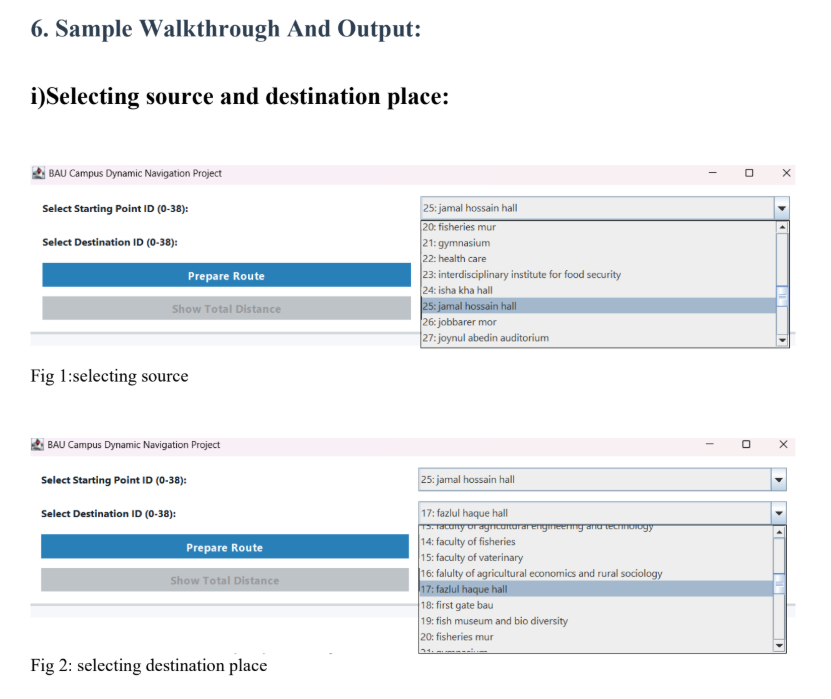
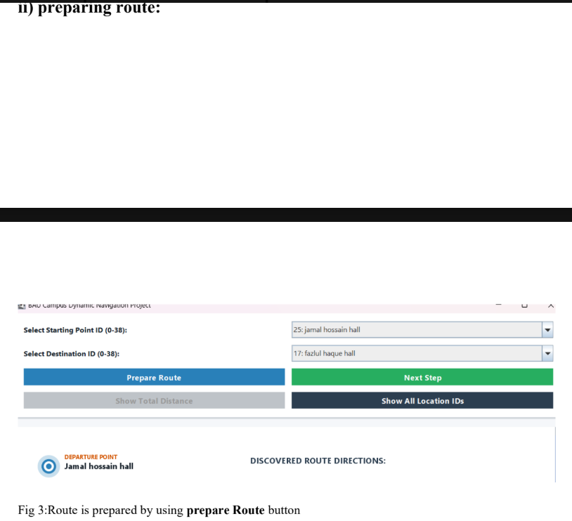
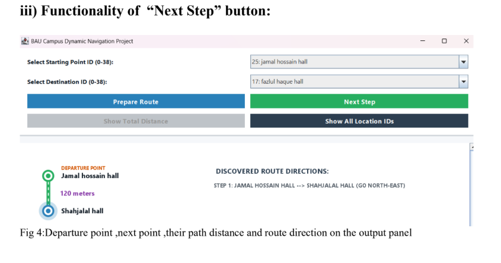
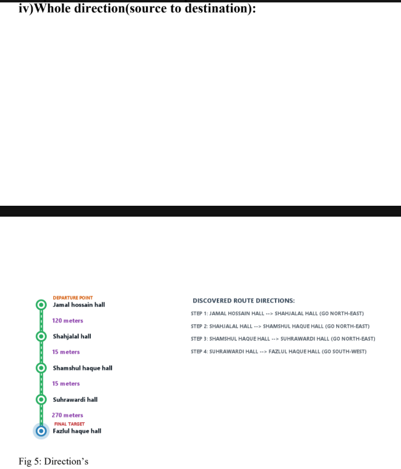
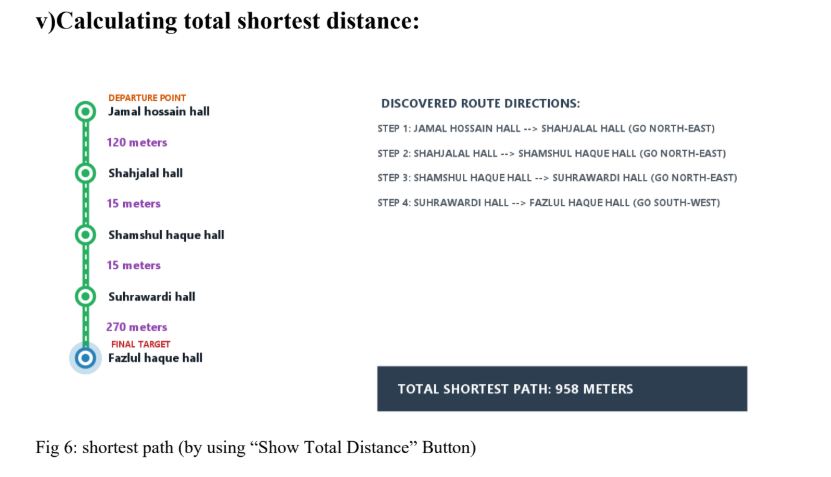
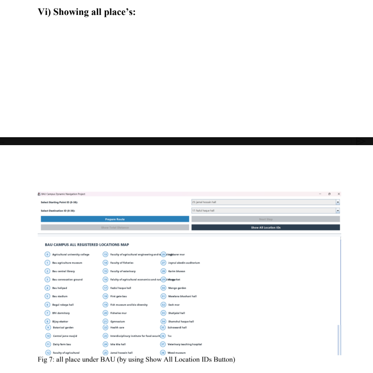

# ShortestPathDirection

Shortes Path indicator inside Bangladesh Agricultural University
1.Introduction
The BAU Campus Shortest Path and Direction System is a desktop application designed
for Bangladesh Agricultural University (BAU).The project models the most popular and
frequently visited places across the campus as a weighted graph and applies a shortest path
algorithm to compute the optimal route between any two selected locations. The system is
implemented in Java using the Swing for the graphical user interface, and it visually
presents the discovered route step by step, along with the distance covered at each stage
and the total shortest distance between the source and destination.
The primary motivation behind this project is to provide new students, visitors, and staff
with a simple, visual tool to understand how different key locations on the BAU campus
are connected, and to identify the shortest walking distance between them without needing
to rely on guesswork or asking around.

2. Objective of the Project

To identify and model the maximum number of popular and important locations
within the BAU campus as nodes of a graph.
To manually identify which locations are directly connected to one another, based on
visual inspection of the campus layout.
To estimate the real world distance between directly connected locations using their
latitude and longitude coordinates.
To represent the campus layout as an undirected weighted graph, since travel
between any two connected points is possible in both directions.
To implement a shortest path algorithm that computes the minimum distance and the
corresponding route between any chosen source and destination.
To build an interactive Java Swing interface that visually reveals the path step by
step and displays the total shortest distance.

 

7. Limitations

Linear Distance Approximation: Since the edge weights are calculated as straight-
line (linear) distances derived from latitude and longitude rather than actual traced

walking paths, a small number of connections may not perfectly represent a real,
physically walkable route.
Occasional Deviation from Real Paths: In most cases, the shortest distance
computed by the system is very close to the shortest distance one would get from a
real world mapping service, but a few exceptions may exist due to the linear distance
assumption.
Manual Effort Constraint: Manually tracing the exact real world walking distance

for all 71 connections among the 39 locations would require significant time and on-
site measurement, which was beyond the scope of this project.

8. Conclusion

This project successfully demonstrates how graph theory and shortest path algorithms can
be applied to a real world campus navigation problem. By manually mapping the direct
connections between 39 key locations at Bangladesh Agricultural University and
calculating distances using geographic coordinates, an undirected weighted graph was

constructed to closely approximate the actual layout of the campus. The Bellman Ford
algorithm was then used to reliably compute the shortest route and distance between any
two selected locations, and the results were presented through an interactive Java Swing
interface. Despite minor limitations arising from the use of linear distance estimation, the
system provides a practical and reasonably accurate tool for campus navigation, and it lays
a solid foundation for future improvements such as more precise path distance
measurement or integration with real map data.